# Integración de Componentes Reutilizables CI/CD (Node.js, Docker, AWS ECR)

Este documento proporciona la guía completa para instalar dependencias locales, ejecutar pruebas, construir contenedores Docker, subirlos a AWS Elastic Container Registry (ECR) y finalmente automatizar todo el proceso mediante un pipeline de GitHub Actions (CI/CD).

El objetivo es que estudiantes comprendan tanto el flujo manual como el automatizado, logrando un pipeline moderno, seguro y profesional.

------------------------------------------------------------------------

# 📌 **Índice**

- Pre-requisitos
- Instalación Local de Dependencias y Herramientas
- Ejecución del Proyecto Node.js
- Construcción y Subida de Imágenes Docker a AWS ECR
- Automatización con GitHub Actions (CI)
- Documentación Oficial de Acciones Usadas

------------------------------------------------------------------------

🧩 Pre-requisitos
Antes de comenzar, asegúrate de contar con:

- Credenciales de AWS para laboratorio o cuenta propia.
- GitHub repository donde configuraremos el pipeline.

Trabajaremos en construir un pipeline, con distintas opciones disponibles, para poder realizar el flujo logico de publicacion de una imagen docker a un ECR en AWS.

------------------------------------------------------------------------

## 📝 Descripción del Flujo Integrado
Este pipeline se estructura en dos fases principales, asegurando que solo el código validado sea convertido en una imagen de contenedor y subido al registro.

### 1. Fase de Integración Continua (CI): Validación del Código

**Preparación:** El flujo comienza con el Checkout del código y la configuración del entorno, instalando Node.js v20. Luego se instalan todas las dependencias del proyecto (npm ci).

**Puerta de Calidad y Seguridad (Gate):** Una vez que las dependencias están instaladas, se ejecutan en paralelo dos tareas críticas de validación:

**Verificación de Compliance (🔒):** Se ejecuta npm audit para revisar y fallar el flujo si existen vulnerabilidades de seguridad críticas.

**Ejecución de Pruebas (🧪):** Se corren las pruebas unitarias y de integración (npm test).

**Decisión (CI Completo):** La fase de CI solo se considera Exitosa si ambos pasos (Compliance y Pruebas) terminan sin errores. Si alguno falla, el pipeline se detiene inmediatamente.

### 2. Fase de Integración Continua (CI): Contenerización y Registro

**Activación:** Esta fase solo se inicia si la fase de CI fue Exitosa (representado por el gate verde).

**Autenticación en la Nube:** El flujo configura primero las credenciales de AWS (utilizando secrets y vars) y luego utiliza la acción de amazon-ecr-login para autenticarse y obtener un token de sesión válido contra el Amazon Elastic Container Registry (ECR).

**Construcción y Envío (Push):** Con la autenticación establecida, el pipeline procede a:

- Construir la imagen de Docker a partir del Dockerfile y etiquetarla localmente.

- Etiquetar la imagen con la URI completa de ECR (incluyendo el SHA del commit como tag).

- Empujar (Push) la imagen final al repositorio ECR especificado por las variables de entorno.

Al completar el paso final, la imagen de contenedor (que contiene código probado y seguro) queda disponible en ECR, lista para ser desplegada en un servicio como ECS o EKS.

```mermaid
flowchart LR

    %% ===== FASE CI =====
    subgraph CI["Fase CI: Validación del Código"]
        Start((Inicio)) --> Checkout[Checkout del Código]
        Checkout --> Setup[Setup Node.js v20]
        Setup --> Install[Instalar Dependencias]

        Install --> Audit[npm audit]
        Install --> Test[npm test]

        Audit --> Gate{¿Pasa el Gate?}
        Test --> Gate
    end

    %% ===== FASE CD =====
    subgraph CD["Fase CD: Contenerización y Registro"]
        AwsCreds[Configurar Credenciales AWS] --> EcrLogin[Login en Amazon ECR]
        EcrLogin --> BuildPush[Build, Tag & Push a ECR]
    end

    %% ===== FLUJO PRINCIPAL =====
    Gate -->|Sí| AwsCreds
    Gate -->|No| Stop((Error))

    BuildPush --> Final((Imagen Publicada en ECR))
```




## Actions de Referencia

De acuerdo a la documentación oficial del Action ```actions/setup-node```, se pueden definir diversas variables, para lo cual, parametrizaremos el argumento ```node-version```, para hacerlo, nos regiremos por la documentacion oficial de Github asociado a [Environment Variables](https://docs.github.com/es/actions/how-tos/write-workflows/choose-what-workflows-do/use-variables)

``` bash
- uses: actions/setup-node@v6
  with:
    # Version Spec of the version to use in SemVer notation.
    # It also admits such aliases as lts/*, latest, nightly and canary builds
    # Examples: 12.x, 10.15.1, >=10.15.0, lts/Hydrogen, 16-nightly, latest, node
    node-version: ''
``` 

De acuerdo a la documentación oficial del Action ```aws-actions/configure-aws-credentials```, se pueden definir diversos secretos, para lo cual, parametrizaremos el argumento ```aws-access-key-id``` | ```aws-secret-access-key``` | ```aws-session-token```, para hacerlo, nos regiremos por la documentacion oficial de Github asociado a [Secrets](https://docs.github.com/es/actions/how-tos/write-workflows/choose-what-workflows-do/use-secrets)

```bash
- name: Configure AWS Credentials
  uses: aws-actions/configure-aws-credentials@v5.1.0
  with:
    aws-access-key-id: ${{ secrets.AWS_ACCESS_KEY_ID }}
    aws-secret-access-key: ${{ secrets.AWS_SECRET_ACCESS_KEY }}
    aws-session-token: ${{ secrets.AWS_SESSION_TOKEN }}
    aws-region: "us-east-1
``` 

Todos estos actions son de referencia, pueden encontrar mas opciones disponbiles en [Github Actions Marketplace](https://github.com/marketplace).